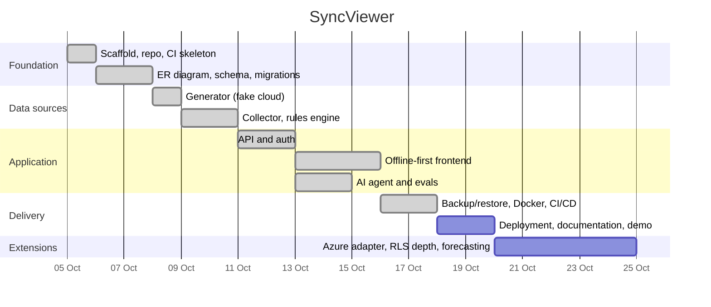

# Project plan (Gantt)

```mermaid
gantt
    title SyncViewer
    dateFormat  YYYY-MM-DD
    axisFormat  %d %b
    section Foundation
    Scaffold, repo, CI skeleton          :done, p0, 2026-10-05, 1d
    ER diagram, schema, migrations       :done, p1, after p0, 2d
    section Data sources
    Generator (fake cloud)               :done, p2, after p1, 1d
    Collector, rules engine              :done, p3, after p2, 2d
    section Application
    API and auth                         :done, p4, after p3, 2d
    Offline-first frontend               :done, p5, after p4, 3d
    AI agent and evals                   :done, p6, after p4, 2d
    section Delivery
    Backup/restore, Docker, CI/CD        :done, p7, after p5, 2d
    Deployment, documentation, demo      :p7b, after p7, 2d
    section Extensions
    Azure adapter, RLS depth, forecasting:p8, after p7b, 5d
```
